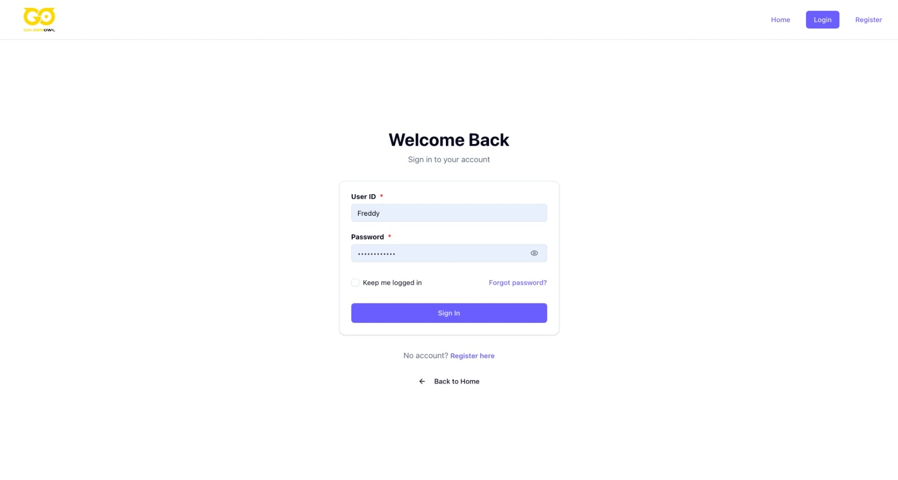
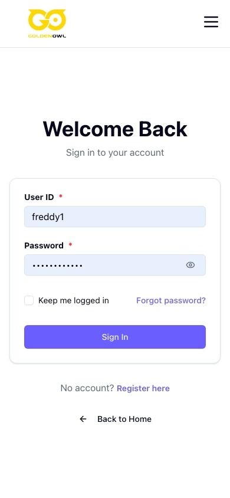
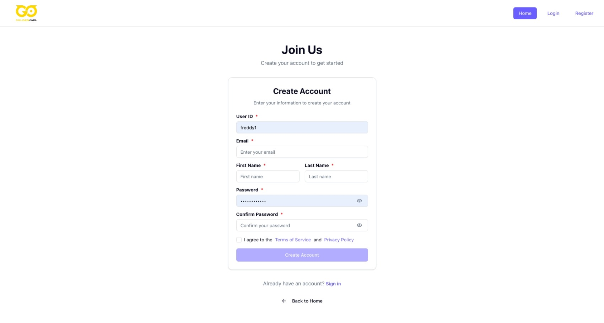
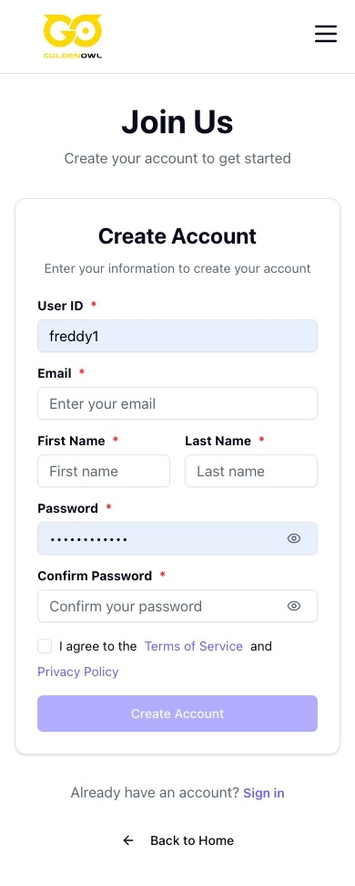
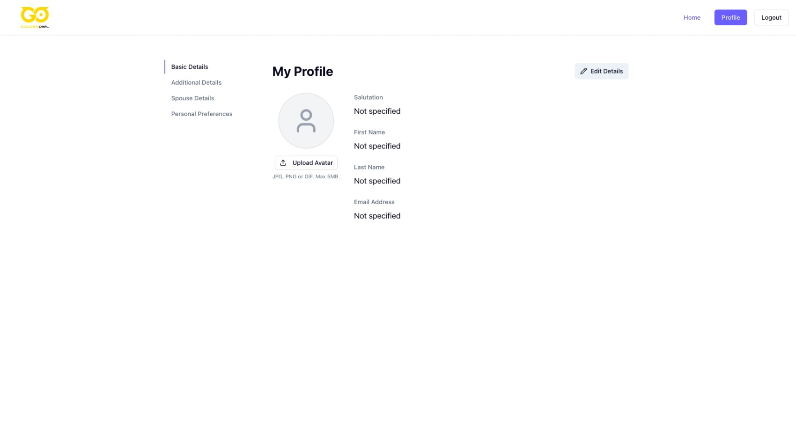
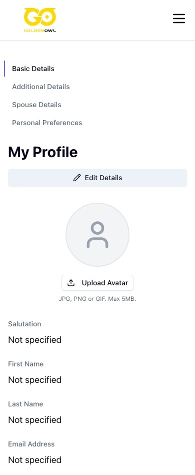
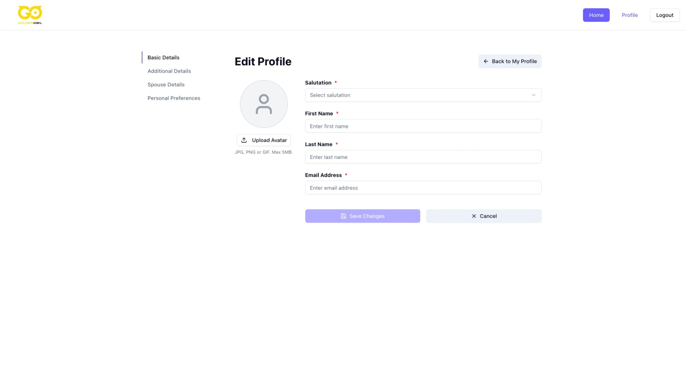
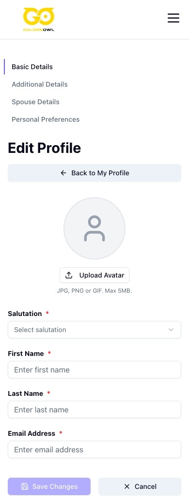

# Freddy Vue Profile Management App

A modern Vue.js 3 application for user profile management with authentication, form handling, and responsive UI components.

## 📱 Preview

### Authentication
| Desktop | Mobile |
|---------|--------|
|  |  |
|  |  |

### Profile Management
| Desktop | Mobile |
|---------|--------|
|  |  |
|  |  |

## 🚀 Features

- **Authentication System**: Login and registration with form validation
- **Profile Management**: Complete user profile CRUD operations
- **Avatar Upload**: File upload with preview functionality
- **Responsive Design**: Mobile-first approach with Tailwind CSS
- **Type Safety**: Full TypeScript support
- **Modern Stack**: Vue 3 + Vite + Pinia + Vue Router
- **UI Components**: Custom component library with shadcn/ui inspiration

## 🛠️ Tech Stack

- **Frontend**: Vue 3 with Composition API
- **Build Tool**: Vite
- **Styling**: Tailwind CSS
- **State Management**: Pinia
- **Routing**: Vue Router 4
- **Type Safety**: TypeScript
- **Form Handling**: Vee-validate with Zod
- **HTTP Client**: TanStack Query (Vue Query)
- **UI Components**: Custom component library
- **Code Formatting**: Prettier

## 📁 Project Structure

```
src/
├── components/          # Reusable UI components
│   ├── ui/             # Base UI components (Button, Input, Select, etc.)
│   └── AppHeader/      # Main header component
├── features/           # Feature-based modules
│   ├── auth/          # Authentication features (Login, Register)
│   └── profile/       # Profile management features
├── views/             # Page components
│   ├── profile/       # Profile-related pages
│   │   ├── BasicDetails/     # Basic profile details
│   │   ├── AdditionalDetails.vue
│   │   ├── SpouseDetails.vue
│   │   └── PersonalPreferences.vue
│   ├── Home.vue       # Home page
│   ├── Login.vue      # Login page
│   ├── Register.vue   # Registration page
│   └── Profile.vue    # Main profile page
├── layouts/           # Layout components
│   └── AppLayout.vue  # Main application layout
├── stores/            # Pinia stores
│   └── auth/          # Authentication store
├── composables/       # Reusable composables
│   ├── useAuthQueries.ts
│   ├── useProfile.ts
│   ├── useProfileQueries.ts
│   └── useSeo/        # SEO utilities
├── lib/               # Utility libraries and API
│   ├── api/           # API client and types
│   └── utils.ts       # Utility functions
├── router/            # Vue Router configuration
├── assets/            # Static assets
├── App.vue            # Root component
├── main.ts            # Application entry point
└── style.css          # Global styles
```

## 🚀 Getting Started

### Prerequisites

- Node.js 20+ 
- pnpm 10+

### Installation

1. **Clone the repository**
   ```bash
   git clone <repository-url>
   cd freddy-vue-1-jul
   ```

2. **Install dependencies**
   ```bash
   pnpm install
   ```

3. **Start development server**
   ```bash
   pnpm dev
   ```

4. **Open your browser**
   Navigate to `http://localhost:5173`

### Available Scripts

- `pnpm dev` - Start development server
- `pnpm build` - Build for production
- `pnpm preview` - Preview production build
- `pnpm format` - Format code with Prettier
- `pnpm format:check` - Check code formatting

## 📱 Features Overview

### Authentication
- User registration and login
- Form validation with Vee-validate and Zod
- Persistent authentication state with Pinia

### Profile Management
- **Basic Details**: Personal information, contact details
- **Additional Details**: Extended profile information
- **Spouse Details**: Partner information management
- **Personal Preferences**: User preferences and settings
- **Avatar Management**: Profile picture upload and preview

### UI/UX
- Responsive design for all screen sizes
- Loading states and error handling
- Form validation with real-time feedback
- Modern, clean interface with Tailwind CSS

## 🎨 Component Library

The app includes a comprehensive UI component library:

- **Form Components**: Input, Select, Checkbox, Form validation
- **Layout Components**: Card, Button, Loading indicators
- **Navigation**: Header, Sidebar navigation
- **Feedback**: Error messages, loading states

## 🔧 Configuration

### Vercel Deployment
The project includes `vercel.json` for seamless deployment to Vercel with proper SPA routing configuration.

## 📝 Development Guidelines

- Use TypeScript for all new code
- Follow Vue 3 Composition API patterns
- Use Tailwind CSS for styling
- Implement proper error handling
- Write descriptive component and function names
- Use Prettier for code formatting

## 🤝 Contributing

1. Fork the repository
2. Create a feature branch
3. Make your changes
4. Run `pnpm format` to format code
5. Submit a pull request

## 📄 License

This project is licensed under the MIT License.

---

Built with ❤️ using Vue 3 and modern web technologies.
